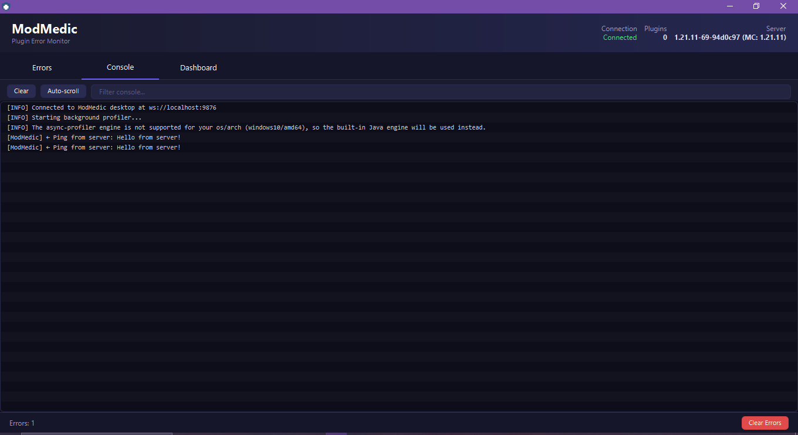
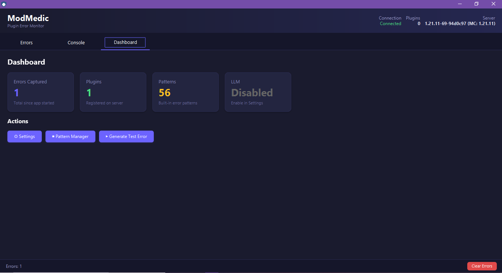

<div align="center">
  
  <h1>ModMedic</h1>
  <p><strong>Real-time error diagnostics for Paper server plugins</strong></p>
  <p>
    
    
    
    
    
  </p>
  <p>
    <a href="#features">Features</a> |
    <a href="#screenshots">Screenshots</a> |
    <a href="#architecture">Architecture</a> |
    <a href="#getting-started">Getting Started</a> |
    <a href="#building">Building</a> |
    <a href="#configuration">Configuration</a> |
    <a href="#license">License</a>
  </p>
</div>

---

ModMedic catches plugin errors on your Paper server in real time and sends them to a desktop companion app for instant diagnosis. No more digging through console logs — see the problem, the cause, and suggested fixes as they happen.

## Features

- **Live Error Feed** — Plugin crashes appear instantly in the desktop UI via WebSocket
- **Smart Diagnosis Engine** — 56 built-in patterns covering NPEs, NoSuchMethodError, ClassNotFoundException, YAML/config issues, version mismatches, and more
- **Causal Chain Parsing** — Follows `Caused by:` chains through the full stack trace
- **Custom Patterns** — Add your own diagnosis patterns through the desktop UI (persisted across restarts)
- **LLM Fallback** — Optional Ollama (local) or OpenAI integration for errors no pattern matches
- **Console Log Viewer** — All server output mirrored to the desktop app with search and auto-scroll
- **Dashboard** — Stats dashboard showing error counts, connected plugins, pattern library size, and LLM status
- **Self-Contained Bundle** — Desktop app ships with JavaFX bundled — no separate install needed
- **Zero Server Config** — Drop the plugin in `plugins/`, start desktop, that's it
- **Configurable** — Plugin `config.yml` and desktop Settings UI for full control

## Screenshots

<div align="center">
  
  <p><em>Live error feed — select an error to view stacktrace and diagnosis side-by-side</em></p>

  
  <p><em>Smart diagnosis engine showing matched pattern, causal chain, and suggested fix</em></p>

  
  <p><em>Console tab — all server output streamed to desktop with search and auto-scroll</em></p>

  
  <p><em>Dashboard — error stats, plugin count, pattern library, LLM status, and quick actions</em></p>
</div>

## Architecture

```
┌──────────────────────┐     WebSocket      ┌──────────────────────────┐
│   Paper Server       │ ◄──────────────────►│   Desktop App (JavaFX)  │
│                      │     ws://:9876      │                          │
│  ┌────────────────┐  │                     │  ┌────────────────────┐  │
│  │ Plugin         │  │   live errors       │  │ DiagnosisEngine    │  │
│  │ ErrorListener  │──┤─────────────────────►│  │  · Built-in (56)  │  │
│  │ WebSocketClient│  │   + console lines   │  │  · Custom patterns │  │
│  │ CommandListener│  │                     │  │  · LLM fallback    │  │
│  └────────────────┘  │                     │  └────────────────────┘  │
│                      │   commands          │  ┌────────────────────┐  │
│                      │◄────────────────────┤──│ FixSuggester      │  │
│                      │   (reload, etc.)    │  └────────────────────┘  │
└──────────────────────┘                     └──────────────────────────┘
```

## Getting Started

### Prerequisites

- **Server:** Paper 1.21.1 (or compatible fork)
- **Desktop:** Windows 10+ (bundle includes JavaFX for Windows)
- **Java 21** (for building from source)

### Quick Start

1. **Download** the [latest release](https://github.com/Xelfordev/ModMedic/releases)
2. **Install the plugin** — copy `server/ModMedic-1.1.0.jar` to your server's `plugins/` folder
3. **Start the desktop app** — run `desktop/bin/ModMedicDesktop.bat`
4. **Start your server** — the plugin connects automatically

Errors will appear in the desktop app as they happen.

### Commands

| Command | Description |
|---------|-------------|
| `/modmedic test` | Fires a test `ServerExceptionEvent` to verify the pipeline |
| `/modmedic ping` | Sends a ping to confirm WebSocket connectivity |
| `/modmedic reload` | Reloads `config.yml` |
| `/modmedic config` | Shows current plugin configuration |

## Building from Source

### Plugin

```bash
cd modmedic-plugin
gradlew build
```

Output: `modmedic-plugin/build/libs/ModMedic-1.1.0.jar`

### Desktop App

```bash
cd modmedic-desktop
gradlew distZip
```

Output: `modmedic-desktop/build/distributions/ModMedicDesktop-1.1.0.zip`

### Full Bundle

Run `build-bundle.bat` from the project root — produces `ModMedic-Bundle/` with both the plugin and the ready-to-run desktop app.

## Configuration

### Plugin (`plugins/ModMedic/config.yml`)

```yaml
desktop_host: localhost
desktop_port: 9876
reconnect_interval_seconds: 5
capture_console_log: true
log_buffer_lines: 200
include_log_in_error_payload: true
```

### Desktop App

Settings are managed through the dashboard UI (⚙ Settings). Configurable:

| Setting | Description |
|---------|-------------|
| WebSocket Port | Port for plugin connection (default: 9876) |
| Max Console Lines | Maximum log lines kept in memory (default: 1000) |
| LLM Integration | Enable/disable LLM fallback |
| Provider | Ollama (local, free) or OpenAI |
| Model | e.g., `llama3.2`, `gpt-4o-mini` |
| API URL | Ollama: `http://localhost:11434/api/generate` |
| API Key | Required for OpenAI only |

Settings are saved to `~/.modmedic/settings.json`.

Custom patterns can be added via the Pattern Manager (▦ Pattern Manager) in the Dashboard tab and are saved to `~/.modmedic/custom_patterns.json`.

## License

ModMedic is open source under the GNU General Public License v3.0. See [LICENSE](LICENSE).

---

<p align="center">
  Created by <a href="https://xelforo.lovestoblog.com">PimpDuck</a> — available on <a href="https://spigotmc.org/resources/modmedic.136459/">SpigotMC</a>
</p>
